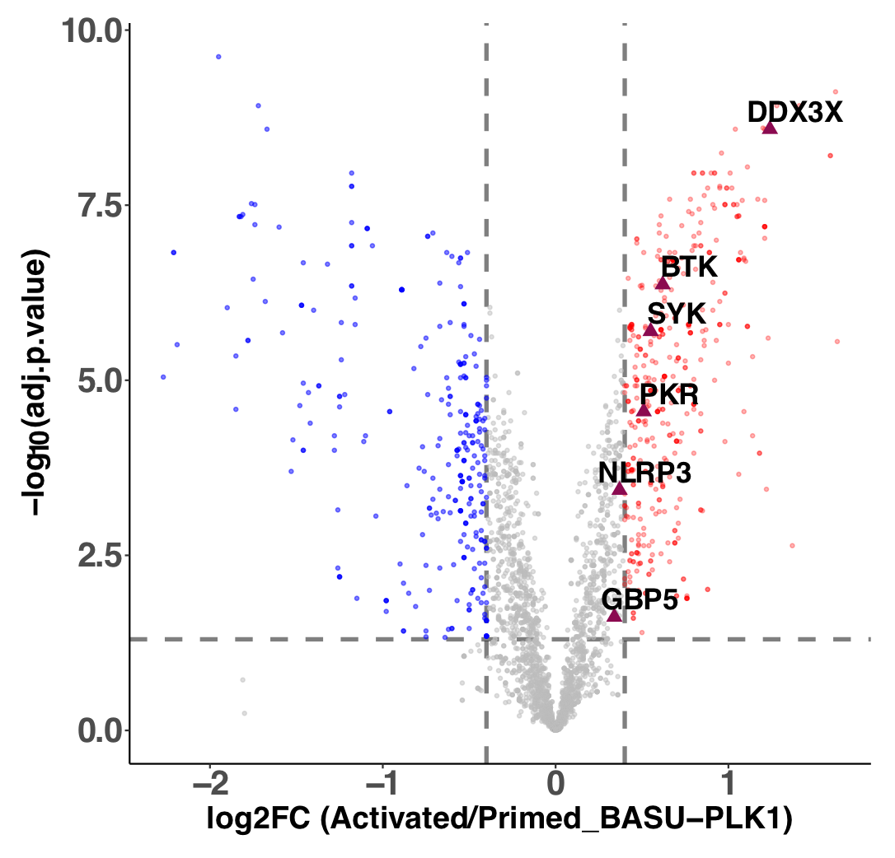
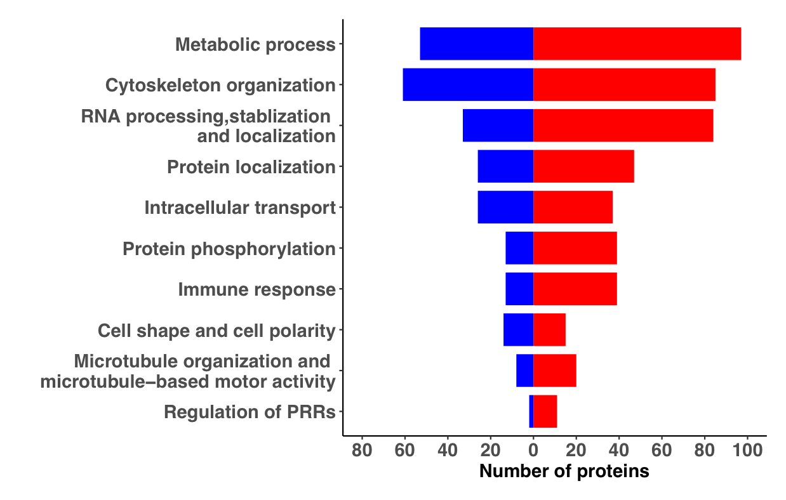
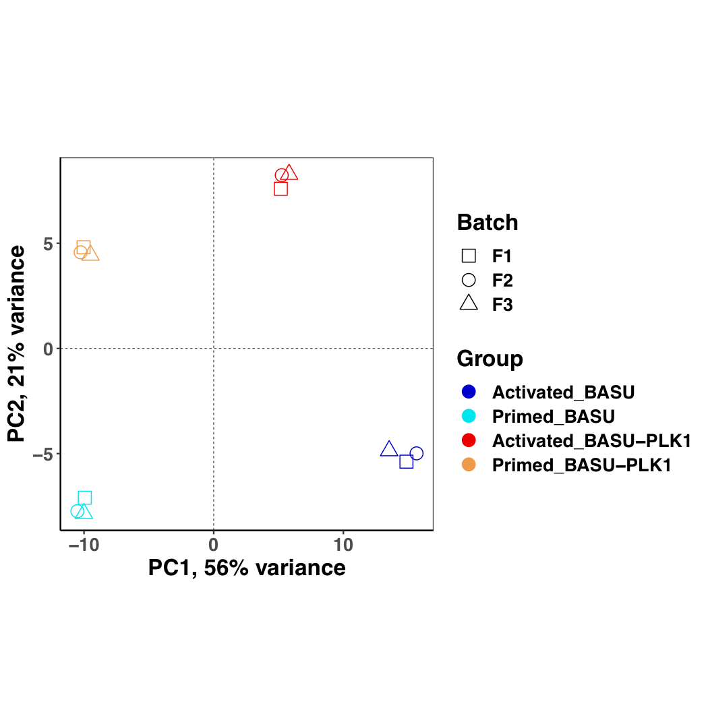
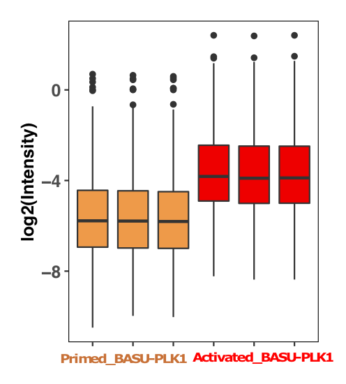
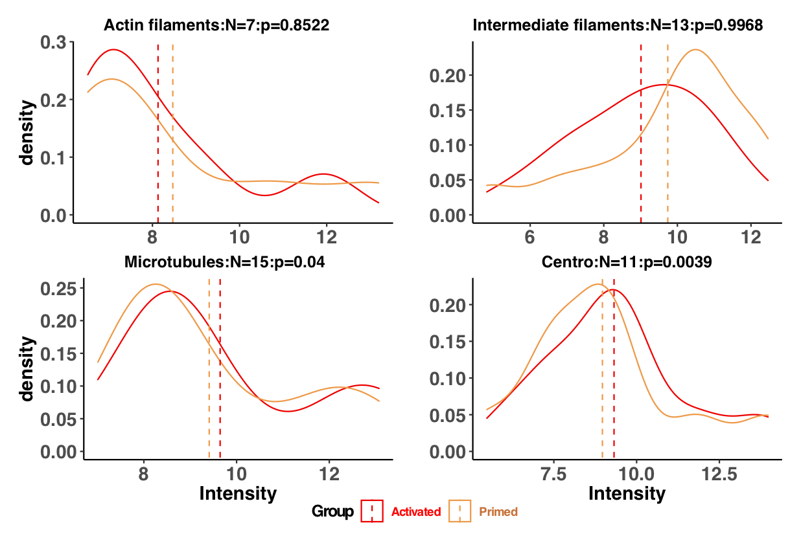
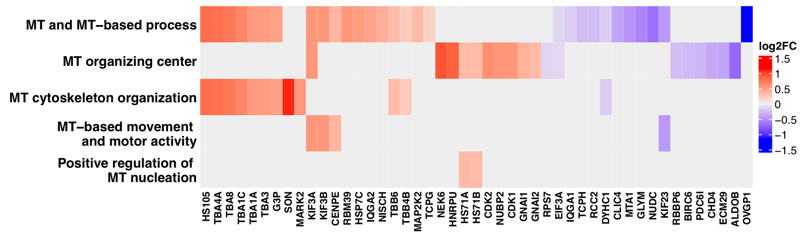

# PLK1 promotes NLRP3 inflammasome activation through reinforcing microtubule organizing center
Marta Baldrighi<sup>1\# </sup>, Christian Doreth<sup>1\# </sup>, Yang Li<sup>2\# </sup>, Xiaohui Zhao<sup>1 </sup>, Hannah Chenoweth<sup>1 </sup>, Kamal Kishore<sup>3 </sup>, Yagnesh Umrania<sup>4 </sup>, David-Paul Minde<sup>3 </sup>, Sarah Thome<sup>1 </sup>, Xian Yu<sup>1 </sup>, Yuning Lu<sup>1 </sup>, Alice Knapton<sup>1 </sup>, James Harrison<sup>1 </sup>, Murray Clarke<sup>1 </sup>, Eicke Latz<sup>5 </sup>, Guillermo de Carcer<sup>6,7 </sup>, Marcos Malumbres<sup>6 </sup>, Bernhard Ryffel<sup>8 </sup>, Clare Bryant<sup>9 </sup>, Jinping Liu<sup>2 </sup>, Kathryn Lilley<sup>3 </sup>, Ziad Mallat<sup>1,10 </sup>, Xuan Li<sup>1\* </sup> <br>
<sup>1</sup>	The Victor Phillip Dahdaleh Heart and Lung Research Institute, Department of Medicine, University of Cambridge, Cambridge, UK.<br> 
<sup>2</sup>	Department of Cardiovascular Surgery, Zhongnan Hospital of Wuhan University, Wuhan, China.
<sup>3</sup>	Cancer Research UK Cambridge Centre, University of Cambridge, Cambridge, UK.<br>
<sup>4</sup>	Department of Biochemistry, Cambridge Centre for Proteomics, University of Cambridge, Cambridge, UK. <br>
<sup>5</sup>	Institute of Innate Immunity, University Hospital, University of Bonn, Bonn, Germany.<br>
<sup>6</sup>	Cell Division and Cancer Group, Spanish National Cancer Research Centre (CNIO), Melchor Fernández Almagro 3, E-28029, Madrid, Spain.<br>
<sup>7</sup>	Cell Cycle & Cancer Biomarkers Group, “Alberto Sols” Biomedical Research Institute (IIBM-CSIC), Arturo Duperier 4, Madrid, Spain.<br>
<sup>8</sup>	UMR7355 INEM, Experimental and Molecular Immunology and Neurogenetics CNRS & Université d’Orleans, Orleans, France. <br>
<sup>9</sup>	Department of Veterinary Medicine, University of Cambridge, Cambridge CB3 0ES, UK.<br>
<sup>10</sup>	Université de Paris, PARCC, INSERM, Paris, France.<br>

♯  equal contribution  <br>
\* Correspondence should be addressed to Xuan Li (xl315@cam.ac.uk)The Victor Phillip Dahdaleh Heart and Lung Research Institute, University of Cambridge, Papworth Road, Cambridge, UK, CB2 0BB. Tel: 0044-(0)1223-746725. Email: xl315@cam.ac.uk


## Abstract

Unabated activation of NLRP3 inflammasome activation is linked with the pathogenesis of
various inflammatory disorders. PLK1 has been widely studied for its role in mitosis. Here,
employing both pharmacological and genetic approaches, we demonstrate that PLK1 promotes
NLRP3 inflammasome activation at cell interphase. Using an unbiased Bio-ID screen for PLK1
interactome in macrophages, we show an enhanced proximal association of NLRP3 with PLK1
upon NLRP3 inflammasome activation. We further confirm the interaction between PLK1 and
NLRP3, and identify the interacting domains. Mechanistically, we show that PLK1 orchestrates
microtubule organizing center (MTOC) structure and NLRP3 subcellular positioning upon
inflammasome activation. Treatment with a selective PLK1 kinase inhibitor suppresses IL-1b
production in in-vivo inflammatory models, including lipopolysaccharide-induced
endotoxemia and monosodium urate-induced peritonitis in mice. Our results uncover an
unprecedented role of PLK1 in regulating NLRP3 inflammasome activation during interphase,
and identify pharmacological inhibition of PLK1 as a potential therapeutic strategy for
inflammatory diseases with excessive NLRP3 inflammasome activation.


## SampleTable
SampleName      |   Condition          |
--------        |  --------------------|
BUT-1	|	Primed_BASU|
BUT-2	|	Primed_BASU|
BUT-3	|	Primed_BASU|
BT-1	|	Activated_BASU|
BT-2	|	Activated_BASU|
BT-3	|	Activated_BASU|
PUT-1	|	Primed_BASU-PLK1|
PUT-2	|	Primed_BASU-PLK1|
PUT-3	|	Primed_BASU-PLK1|
PT-1	|	Activated_BASU-PLK1|
PT-2	|	Activated_BASU-PLK1|
PT-3	|	Activated_BASU-PLK1|

## Raw/Processed analysis Data Availability

| Tables       | Downloads            | Description|
--------       |  --------------------|------------|
Supplementary_Table_1Table 1.xlsx |[[XLSX](Figures_Tables/Supplementary_Table_1.xlsx)]|Raw data and processed data for Figures.|
Supplementary_Table_2.xlsx |[[XLSX](Figures_Tables/Supplementary_Table_2.xlsx)]|Gene ontology analysis results.|

## Analysis R code is avaialble

**CAD_xl305_0001-PTvsPUT_withBASU_23_Dec_2021.R**

## Methods

There are total 7216 proteins identified from three TMT batches and 12 samples. However, only 3063 of these proteins were consistently identified in all 12 samples. Missing protein values across different samples in one TMT batch are relatively low, and no protein with missing values was only present in the primed or activated samples respectively. Missing values were removed from subsequent analysis in order to perform differential expression (DE) analysis, to identify interacting proteins which are upregulated and downregulated in activated vs primed cells. There were 60 proteins with low FDR confidence, which we removed to keep high quality proteins in the DE analysis. Total 3063 proteins were remained after missing value and low FDR removing. Then, UniProtKB/Swiss-Prot (reviewed, manually annotated, March 2021) search was applied to filter out the unreviewed proteins in the list. Eventually, 1252 proteins passed the quality control and were applied for the following analysis (DE, Gene Ontology (GO) and subcellular localization).

Firstly, normalization and batch correction was applied for all samples using R (version 4.1.2) qPLEXanalyzer (version 1.12.0) package “normalizeScaling” function. The central median normalization was used for log-scaled intensities. “ComBat” function (sva package version 3.42.0) was performed for batch correction. Paired DE analysis identified 247 up-regulated proteins and 172 down-regulated proteins with the cut-off absolute log2 Fold Change greater than 0.4 (equals to absolute 1.3 fold change) and Benjamini-Hochberg corrected adjusted pvalue (adj.P.Val) less than 0.05. The total significant 419 DEs was used as input for Gene Ontology unbiased analysis with clusterProfiler (version 4.2.2 R package). Subcellular localization analysis used the data from human protein atlas website (https://www.proteinatlas.org/humanproteome/subcellular), and mouse proteins were converted to human and then match the main location. Due to the mouse/human orthology, 999 genes out 1252 were assigned with human subcellular localization. To check the interacting protein with PLK1 at subcellular location between primed and activated samples, density plot and p-value analysis were performed for the selected categories. All scripts, with the details of software versions, a pipeline usage report and protein intensities files, are freely available from https://github.com/CAD-ZM-BFX/Baldrighi_Doreth_Li.


**References:**

[1] R Core Team (2020). R: A language and environment for statistical computing. R Foundation for Statistical Computing, Vienna, Austria. URL https://www.R-project.org/.<br>
[2] Zuguang Gu, et al., Complex heatmaps reveal patterns and correlations in multidimensional genomic data, Bioinformatics, 2016<br>
[3] Yu G, Wang L, Han Y, He Q (2012). “clusterProfiler: an R package for comparing biological themes among gene clusters.” OMICS: A Journal of Integrative Biology, 16(5), 284-287. doi: 10.1089/omi.2011.0118. <br>
[4] Wu T, Hu E, Xu S, Chen M, Guo P, Dai Z, Feng T, Zhou L, Tang W, Zhan L, Fu x, Liu S, Bo X, Yu G (2021). “clusterProfiler 4.0: A universal enrichment tool for interpreting omics data.” The Innovation, 2(3), 100141. doi: 10.1016/j.xinn.2021.100141. <br>


## Main/Supplementary Figures_Tables

| Figures       | Downloads            |Image         | Legend (Corresponding Fig)|
--------        |  --------------------|--------------| ------------------------  |
Fig3e_Mar_2022.pdf | [[PDF](Figures_Tables/Fig3e_Mar_2022.pdf)]| | Volcano plot for interactome with PLK1 after NLRP3 inflammsome activation (activated), compared to the interactome with PLK1 under primed condition (primed). Red dots represent the enhanced protein interaction in the Activated group, blue dots represent the enhanced protein interaction in the Primed group, and grey dots are non-significant with the selected threshold cut-off (the cut-off threshold for log2FoldChange is 0.4, equal to complete 1.3 fold change; the significance adjusted P value is less than 0.05, by Benjamini-Hochberg correction).|
Fig3f_Mar_2022.pdf | [[PDF](Figures_Tables/Fig3f_Mar_2022.pdf)]| | Gene Ontology analysis shows the up (red)/down (blue) -regulated interacting proteins with PLK1 after NLRP3 inflammasome activation in protein subgroups with corresponding numbers.|
SFig5b_Mar_2022.pdf | [[PDF](Figures_Tables/SFig5b_Mar_2022.pdf)]| | The interactome was analyzed under primed condition (primed), or after NLRP3 inflammasome activation (activated). PCA (Principal Components Analysis) shows the grouped replicates under each condition (BASU only under Primed or Activated condition; BASU-PLK1 under Primed or Activated condition). |
SFig5c_Mar_2022.pdf | [[PDF](Figures_Tables/SFig5c_Mar_2022.pdf)]| | Boxplot of normalized intensities of interacting proteins with PLK1 under primed condition or activated condition upon normalization using central median plus PLK1. |
SFig5d_Mar_2022.pdf | [[PDF](Figures_Tables/SFig5d_Mar_2022.pdf)]| | Density plot shows intensity shift of interacting proteins with PLK1 under primed or activated condition at four subcellular cytoskeletal localization. Paired t-test for each location group is performed.  |
SFig5e_Mar_2022.pdf | [[PDF](Figures_Tables/SFig5e_Mar_2022.pdf)]| | Heatmap plot shows the up (red shades) /down (blue shades)-regulated interacting proteins with PLK1 in microtubule-related pathways after NLRP3 inflammasome activation.  |


## Software R Versions and other packages

````
R version 4.1.2 (2021-11-01)
Platform: x86_64-apple-darwin17.0 (64-bit)
Running under: macOS Monterey 12.1

Matrix products: default
LAPACK: /Library/Frameworks/R.framework/Versions/4.1/Resources/lib/libRlapack.dylib

Random number generation:
 RNG:     Mersenne-Twister
 Normal:  Inversion
 Sample:  Rounding

locale:
[1] en_GB.UTF-8/en_GB.UTF-8/en_GB.UTF-8/C/en_GB.UTF-8/en_GB.UTF-8

attached base packages:
[1] stats4    stats     graphics  grDevices utils     datasets  methods   base     

other attached packages:
 [1] cowplot_1.1.1        circlize_0.4.14      reshape2_1.4.4       ggrepel_0.9.1        xlsx_0.6.5          
 [6] knitr_1.37           gridExtra_2.3        sva_3.42.0           genefilter_1.76.0    mgcv_1.8-38         
[11] nlme_3.1-155         qPLEXanalyzer_1.12.0 forcats_0.5.1        stringr_1.4.0        dplyr_1.0.8         
[16] purrr_0.3.4          readr_2.1.1          tidyr_1.2.0          tibble_3.1.6         ggplot2_3.3.5       
[21] tidyverse_1.3.1      pRoloc_1.34.0        BiocParallel_1.28.3  MLInterfaces_1.74.0  cluster_2.1.2       
[26] annotate_1.72.0      XML_3.99-0.8         AnnotationDbi_1.56.2 IRanges_2.28.0       DT_0.20             
[31] MSnbase_2.18.0       ProtGenerics_1.26.0  S4Vectors_0.32.3     mzR_2.28.0           Rcpp_1.0.8.2        
[36] Biobase_2.54.0       BiocGenerics_0.40.0


loaded via a namespace (and not attached):
  [1] utf8_1.2.2             tidyselect_1.1.2       RSQLite_2.2.10         htmlwidgets_1.5.4      grid_4.1.2            
  [6] lpSolve_5.6.15         pROC_1.18.0            devtools_2.4.3         munsell_0.5.0          codetools_0.2-18      
 [11] preprocessCore_1.56.0  future_1.23.0          withr_2.5.0            colorspace_2.0-3       GOSemSim_2.20.0       
 [16] filelock_1.0.2         rstudioapi_0.13        rJava_1.0-6            DOSE_3.20.1            mzID_1.32.0           
 [21] listenv_0.8.0          GenomeInfoDbData_1.2.7 bit64_4.0.5            rprojroot_2.0.2        coda_0.19-4           
 [26] parallelly_1.30.0      vctrs_0.3.8            generics_0.1.2         ipred_0.9-12           xfun_0.30             
 [31] BiocFileCache_2.2.1    randomForest_4.6-14    R6_2.5.1               doParallel_1.0.17      GenomeInfoDb_1.30.1   
 [36] clue_0.3-60            locfit_1.5-9.4         MsCoreUtils_1.6.0      bitops_1.0-7           cachem_1.0.6          
 [41] fgsea_1.20.0           assertthat_0.2.1       scales_1.1.1           nnet_7.3-17            gtable_0.3.0          
 [46] affy_1.72.0            globals_0.14.0         processx_3.5.2         timeDate_3043.102      rlang_1.0.2           
 [51] GlobalOptions_0.1.2    splines_4.1.2          ModelMetrics_1.2.2.2   impute_1.68.0          hexbin_1.28.2         
 [56] broom_0.7.12           modelr_0.1.8           BiocManager_1.30.16    yaml_2.3.5             backports_1.4.1       
 [61] qvalue_2.26.0          caret_6.0-90           tools_4.1.2            lava_1.6.10            usethis_2.1.5         
 [66] affyio_1.64.0          ellipsis_0.3.2         RColorBrewer_1.1-2     ggdendro_0.1.22        proxy_0.4-26          
 [71] sessioninfo_1.2.2      plyr_1.8.6             progress_1.2.2         zlibbioc_1.40.0        RCurl_1.98-1.6        
 [76] ps_1.6.0               prettyunits_1.1.1      rpart_4.1.16           viridis_0.6.2          sampling_2.9          
 [81] haven_2.4.3            LaplacesDemon_16.1.6   fs_1.5.2               magrittr_2.0.2         data.table_1.14.2     
 [86] DO.db_2.9              reprex_2.0.1           pcaMethods_1.86.0      mvtnorm_1.1-3          matrixStats_0.61.0    
 [91] pkgload_1.2.4          xlsxjars_0.6.1         hms_1.1.1              evaluate_0.15          xtable_1.8-4          
 [96] readxl_1.3.1           mclust_5.4.9           shape_1.4.6            testthat_3.1.2         compiler_4.1.2        
[101] biomaRt_2.50.2         ncdf4_1.19             crayon_1.5.0           htmltools_0.5.2        tzdb_0.2.0            
[106] segmented_1.4-0        lubridate_1.8.0        DBI_1.1.2              dbplyr_2.1.1           MASS_7.3-55           
[111] rappdirs_0.3.3         Matrix_1.4-0           brio_1.1.3             cli_3.2.0              vsn_3.62.0            
[116] parallel_4.1.2         gower_0.2.2            pkgconfig_2.0.3        recipes_0.1.17         MALDIquant_1.21       
[121] xml2_1.3.3             foreach_1.5.2          XVector_0.34.0         prodlim_2019.11.13     rvest_1.0.2           
[126] callr_3.7.0            digest_0.6.29          Biostrings_2.62.0      cellranger_1.1.0       rmarkdown_2.13        
[131] fastmatch_1.1-3        edgeR_3.36.0           dendextend_1.15.2      curl_4.3.2             kernlab_0.9-29        
[136] gtools_3.9.2           jsonlite_1.8.0         lifecycle_1.0.1        desc_1.4.0             viridisLite_0.4.0     
[141] limma_3.50.0           fansi_1.0.2            pillar_1.7.0           lattice_0.20-45        KEGGREST_1.34.0       
[146] fastmap_1.1.0          httr_1.4.2             pkgbuild_1.3.1         survival_3.2-13        GO.db_3.14.0          
[151] glue_1.6.2             remotes_2.4.2          FNN_1.1.3              png_0.1-7              iterators_1.0.14      
[156] bit_4.0.4              class_7.3-20           stringi_1.7.6          mixtools_1.2.0         blob_1.2.2            
[161] memoise_2.0.1          e1071_1.7-9            future.apply_1.8.1        
 .....           
````

## Contact

Contact Xiaohui Zhao (xz289 -at- cam.ac.uk)
